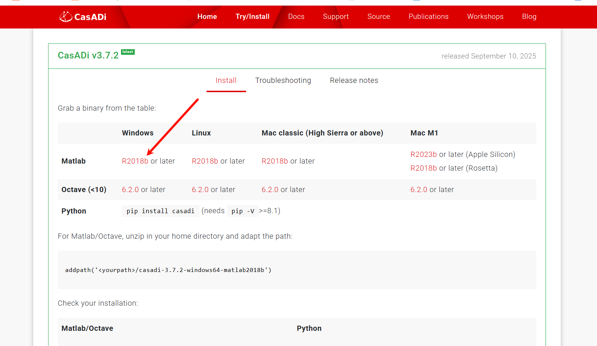
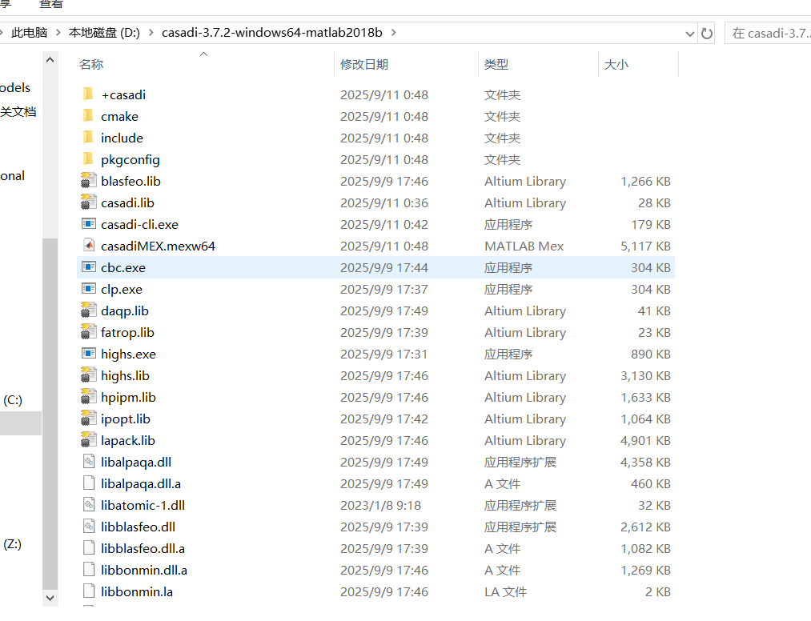
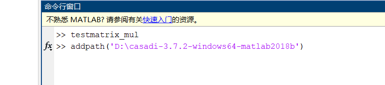
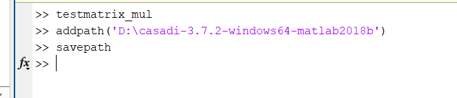
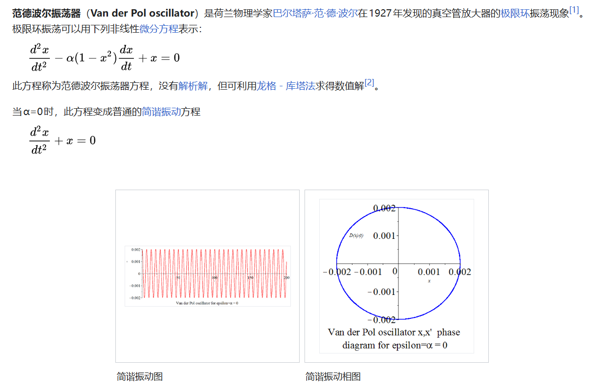

# NMPC Test

## 主要代码

step1：computational graphs

用于计算下一步的x1和x2的状态，建立非线性系统模型，其中`MX.`是CasADi中用来声明符号变量的命令，最后的f=Function是将微分方程封装成了一个可以直接调用的函数，函数的名字为f。

```matlab
import casadi.*

x1 = MX.sym('x1');
x2 = MX.sym('x2');
x = [x1;x2];
u = MX.sym('u');

ode = [(1-x2^2)*x1-x2+u;x1];
size(ode)

f = Function('f',{x,u},{ode});
f([0.2;0.8],0.1)
```

step2：time-integration methods

对微分方程进行离散化，配置数值积分器，预测范围为T = 10s，分为N=20区间，控制周期为T = T/N =0.5s；

```matlab
T = 10;% 总控制时常
N = 20;% 控制区间，即计算机0.5s改变一次控制量

% 配置积分器选项，Integrator Options
intg_options = struct;
intg_options.tf = T/N;
intg_options.simplify = true;
intg_options.number_of_finite_elements = 4;% 切分控制步，计算四次RK4结果，最后只输出0.5s后结束的结果

dae = struct;
dae.x = x;
dae.p = u;
dae.ode = f(x,u);
% 龙格库塔数值积分,积分器名字为intg，dae是differential-algebraic Equations微分代数方程组的缩写
% dae定义了需要求解什么，intg_options定义了如何求解
intg = integrator('intg','rk',dae,intg_options)
```

微分方程本质上是：
$$
\dot{x} =f(t,x)
$$
而要求解x(t)，就是对导数进行积分运算

因此经常会用欧拉法、RK4离散化

也就是用RK4求解下一步的x值，也就是已知在0s的x值，求解0.5s之后的x值

step3：Function objects 生成离散状态转移函数

```matlab
%% 
%给定初始状态0，1，控制参数为0
% intg([0;1],0,[],[],[],[])
res = intg('x0',x,'p',u);
% 会返回一个结果结构体 res (result)。里面包含了积分器算出来的所有符号结果。
x_next = res.xf;
% 函数封装，函数名称为F，输入变量为x，i，输出变量为x_next，后面为给输入和输出贴上字符串标签
F = Function('F',{x,u},{x_next},{'x','u'},{'x_next'});
% 输入示例：当前系统状态为x1=0，x2=1，施加控制量为0，0.5s后系统会是什么状态
% F([0;1],0)
% F([0.1;0.9],0.1)
```

step4：concepts from functional programming 开环前向仿真

```matlab
%% 开环前向仿真
% 上面代码N=20，也就是直接计算20步，将未来10s的预测轨迹绘制
% 如果不用mapaccum函数，需要写循环代码为：
% 普通的 for 循环写法
% for k = 1:N
%     x_next = F(x_current, u(k));
%     x_current = x_next;
% end
sim = F.mapaccum(N);

% 给定初始状态
x0 = [0;1];
% cos为控制输入u，具体为cos1，cos2，cos3、、、cos20
% res为2*N的矩阵，充满了未来N步每一步的状态
res = sim(x0,cos(1:N));

figure
% 生成0-T时间段的横坐标，划分为N+1段
tgrid = linspace(0,T,N+1);
% 将初始状态拼接在矩阵的最前面
plot(tgrid,full([x0 res]));
legend('x1','x2');
xlabel('t[s]');
```

step5：symbolic differentation 雅可比矩阵分析

画出雅可比矩阵的稀疏结构图

```matlab
%% 引入未知量
% 用一个全是未知步的符号向量u来代表未来10s的输入
U = MX.sym('U',1,N);
% 将未知量输入
X_all = sim(x0, U);
% 提取单一变量，即只提取x1的状态量
X1 = X_all(1, :);
% 计算向量 X1 对向量 U 的雅可比矩阵，也就是计算改变的U对X1会产生多大的影响
% 优化求解器正是依赖这个矩阵（梯度方向），才知道该往哪个方向去调整U才能让误差变小。
J = jacobian(X1,U);
% 返回矩阵维度与矩阵是否稀疏（spy）
size(J);
% 一定是一个下三角矩阵，因为第5s的控制输入会影响第6s，第7s，但不会影响第2s和第3s
spy(J);
% 封装为一个可以导入具体数值的函数，输入U就能输出具体的梯度矩阵J是多少
Jf = Function('F',{U},{J});
% 代入全为0的控制序列，计算此时雅可比矩阵的数值
% full：把 CasADi 的稀疏矩阵转成 MATLAB 普通矩阵
% imshow函数：用处理图像的方式把这个矩阵画出来。数值越大的地方越亮（偏白），数值越小或为 0 的地方越暗（全黑）
imshow(full(Jf(0)));
```

`imshow` 能直观看到“敏感度到底有多大”。通常对角线附近的亮度最高，因为刚施加控制的瞬间，状态改变得最直接；随着时间推移，这种影响会逐渐在复杂的非线性动态中衰减或扩散。

step6：Optimal control problem using mutiple-shooting 建立最优化问题

```matlab
%% 最优化
% 使用CasADi的opti堆栈
% 初始化opti环境，实例化一个 Opti 对象
opti = casadi.Opti();

% 输入未知量
x = opti.variable(2,N+1);
u = opti.variable(1,N);
% 声明已知量，p表示当前时刻的真实状态
p = opti.parameter(2,1);

% 目标函数，sumsqr函数为求元素平方和的函数，x表示希望系统状态越小越好，意味着想把状态控制到原点 x=[0;0]
% u希望控制输入越小越好,意味着想省油、省电，不想让执行机构剧烈抖动
opti.minimize(sumsqr(x)+sumsqr(u));

% 施加动力学约束，下一步的状态必须为公式（物理模型）F给的状态
for k=1:N
    opti.subject_to(x(:,k+1)==F(x(:,k),u(:,k)));
end
opti.subject_to(-1 <= u <= 1);
% 第一步的状态必须严格等于当前传感器测量的实际状态p，因此p为实际值
opti.subject_to(x(:,1)==p);
% 打印状态
opti
```

配置求解器与绘图代码：

```matlab
%%
% 第一步：配置求解器算法，使用SQP序列二次规划求解非线性系统
opti.solver('sqpmethod', struct('qpsol','qrqp'));

% 第二步：给参数 p 赋初值，初始值为0和1
opti.set_value(p, [0; 1]);

% 第三步：求解opti，进行最优化计算
sol = opti.solve();
%% 
% 绘制未来10s的状态图
figure
hold on
plot(tgrid,sol.value(x));
% 使用阶梯图，反应了零阶保持器
stairs(tgrid,[sol.value(u) nan],'-.');
xlabel('t[s]');
ylabel('Values');  
legend('x1', 'x2', 'u');   

% 画出约束条件雅可比矩阵的稀疏结构图，opti.g表示所有的约束条件
% 计算出约束对变量的偏导数矩阵，求解器利用带状稀疏性，可以将大型矩阵求逆运算加速
spy(jacobian(opti.g,opti.x));

% 目标函数海森矩阵 (Hessian) 的稀疏结构图，opti.f 为目标函数
spy(hessian(opti.f,opti.x));

% 重新配置求解器，将所有的输出打印全部关掉
opts = struct;
opts.qpsol = 'qrqp';
opts.print_header = false;
opts.print_iteration = false;
opts.print_time = false;
opts.qpsol_options.print_iter = false;
opts.qpsol_options.print_header = false;
opts.qpsol_options.print_info = false;
opti.solver('sqpmethod',opts);
```

step7：MPC循环

```matlab
%% 封装控制器
% opti.to_function()的作用是：提取整个优化问题（包括约束、目标函数、底层的 SQP 算法配置），将其编译压缩成一个单一的、运行极快的函数对象M
% 函数的输出u只提取了第一列u(:,1)，符合MPC滚动优化的思想
M = opti.to_function('M',{p},{u(:,1)},{'p'},{'u_opt'});

%% MPC loop
X_log = [];
U_log = [];

% 定义初始状态
x = [0,1];
% 循环80次，看80步的表现
for i = 1:4*N
    % CasADi 算出来的结果默认是内部的稀疏矩阵格式 (DM)。full() 的作用是把它“解压”成MATLAB认识的普通数字
    u = full(M(x));
    
    U_log(:,i) = u;
    X_log(:,i) = x;
    
    % [0;rand*0.02]引入随机扰动
    x = full(F(x,u))+[0;rand*0.02];
end
```

绘图代码：

```matlab
%% 
figure
hold on
tgrid_mpc = linspace(0,4*T,4*N+1);
plot(tgrid_mpc,[x0 X_log]);
stairs(tgrid_mpc,[U_log nan],'-.')
xlabel('t[s]');
legend('x1','x2','u')
```

********

## MATLAB导入外部包



下载文件并且解压



添加到matlab路径





代码为：

```matlab
addpath('D:\casadi-3.7.2-windows64-matlab2018b')
savepath
```

## 非线性微分方程：范德波尔振荡器



上面描描述的微分方程可以表示为：


$$
\ddot{x} -\alpha (1-x^2)\dot{x} +x=0
$$
将$x_2$代入，有：
$$
\ddot{x}_2 -\alpha (1-x_2^2)\dot{x}_2 +x_2=0
$$


因为

$$
\left\{\begin{matrix}\dot{x}_2=x_1 
 \\\ddot{x}_2 =\dot{x}_1
\end{matrix}\right.
$$

设$\alpha = 1$，移项，最终有：


$$
\left\{
\begin{aligned}
\dot{x}_1 &= (1-x_2^2)\dot{x}_1 - x_2 + u \\
\dot{x}_2 &= x_1
\end{aligned}
\right.
$$


## 参考视频与相关网页

代码视频：https://www.youtube.com/watch?v=JI-AyLv68Xs

利用CasADi来构建计算图（computationla graphs），以此来定义和计算常微分方程（ODE）

CasADi下载链接：[CasADi - Gets](https://web.casadi.org/get/)

范德波尔振荡器：https://zh.wikipedia.org/wiki/%E8%8C%83%E5%BE%B7%E6%B3%A2%E5%B0%94%E6%8C%AF%E8%8D%A1%E5%99%A8
